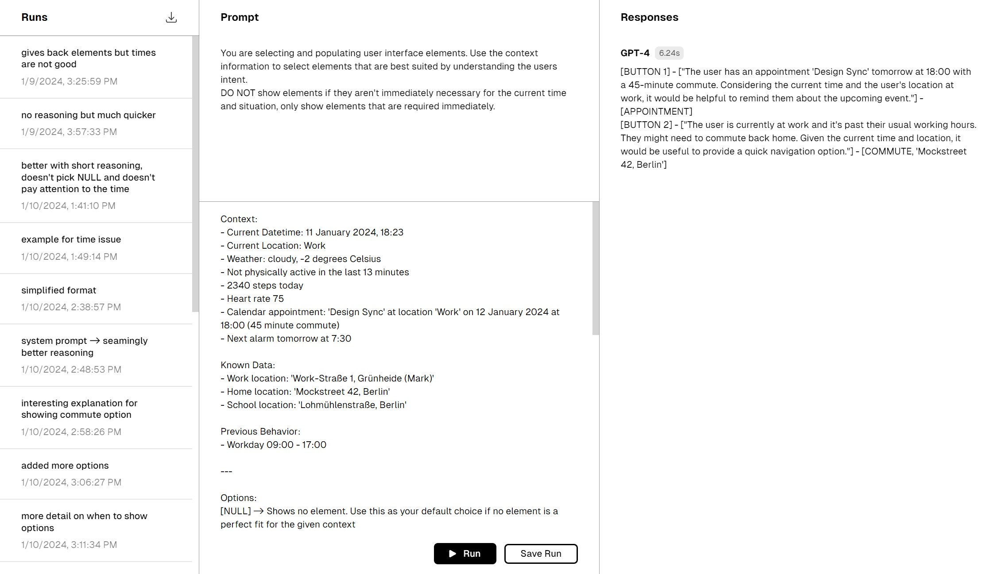

# AI Playground

This offers a playground to compare the output of different language models. Implemented are the openai api and the together.xyz api. Runs can be saved with a name and the list of runs can be downloaded as a csv

Install dependencies with `pnpm install` and run with `pnpm dev`. Make sure to provide api keys in the env file.

